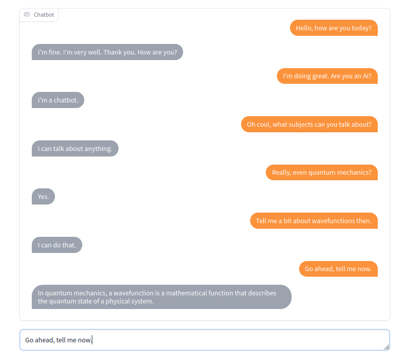

# Prediction Guard Chatbot - ChatPG

This is a simple chatbot built on top of Prediction Guard's text generation capabilities. 



## Setup

In order to run this demo:

1. Create a Prediction Guard account and get an access token (as described [here](https://docs.predictionguard.com/))
2. Install the Python requirements:

    ```
    $ pip install -r requirements.txt
    ```

5. Export your Prediction Guard access token to an environmental variable:

    ```
    $ export PREDICTIONGUARD_TOKEN=<your access token>
    ```

4. Run `configure.py` to setup the Prediction Guard endpoint for generating chat responses:

    ```
    $ python configure.py
    ```

5. Run `app.py` to start the demo locally:

    ```
    $ python app.py
    ```

6. Visit the link displayed to see the Gradio demo. It should be something like `http://127.0.0.1:7860`.